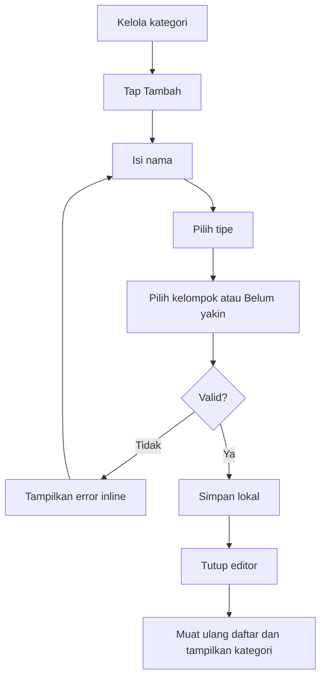

# Desain UI/UX: Kelola Kategori

Tanggal desain: 13 Juni 2026  
Status: Usulan untuk MVP laporan arus kas  
Sumber utama: [`research-cash-flow-report.md`](research-cash-flow-report.md)

## Ringkasan Keputusan

Layar `Kelola Kategori` diubah dari daftar read-only menjadi pusat perawatan kategori dan
klasifikasi arus kas. Layar harus membantu user:

1. Menemukan kategori yang belum dikelompokkan.
2. Membuat kategori dengan nama, tipe transaksi, dan kelompok arus kas.
3. Mengedit kategori tanpa diam-diam mengubah laporan historis.
4. Membuka transaksi yang memakai kategori tersebut untuk memeriksa hasil.

Desain menggunakan satu daftar dengan dua bagian collapsible:

```text
Perlu dirapikan
Kategori lain
```

Kategori `UNCLASSIFIED` ditempatkan pada bagian `Perlu dirapikan`, tetapi tidak diperlakukan
sebagai error. Istilah formal akuntansi tidak menjadi label utama. UI memakai:

| Domain | Label utama |
| --- | --- |
| `OPERATING` | Aktivitas harian |
| `INVESTING` | Aset & investasi |
| `FINANCING` | Pinjaman & modal |
| `UNCLASSIFIED` | Belum dikelompokkan |

Create dan edit memakai editor yang sama. Perubahan klasifikasi selalu menjelaskan dampak terhadap
transaksi lama sebelum disimpan.

## Tujuan Objektif

### Tujuan pengguna

| Tujuan | Indikator keberhasilan |
| --- | --- |
| Menemukan kategori yang perlu diperbaiki | Terlihat pada bagian `Perlu dirapikan` tanpa filter tambahan |
| Menemukan kategori meskipun query salah ketik | Hasil relevan tetap muncul dan diurutkan berdasarkan kedekatan |
| Memahami fungsi setiap kategori | Nama, tipe, dan kelompok arus kas terlihat tanpa membuka editor |
| Membuat kategori | Selesai tanpa istilah akuntansi wajib dan tanpa field selain nama dan tipe |
| Mengubah klasifikasi dengan aman | User memilih cakupan histori secara sadar |
| Memeriksa dampak kategori | Transaksi kategori dapat dibuka dengan filter yang setara |

### Tujuan produk

- Meningkatkan proporsi transaksi regular yang memiliki klasifikasi selain `UNCLASSIFIED`.
- Menjaga flow pencatatan tetap cepat; semua pekerjaan perapian berada di flow sekunder.
- Menjaga laporan historis stabil dan dapat dijelaskan.
- Menggunakan bahasa netral, bukan bahasa yang menghakimi kualitas data user.
- Menjaga implementasi ringan dengan Android Views dan komponen lokal.

### Non-tujuan

- Mengajari akuntansi formal.
- Memaksa semua kategori langsung diklasifikasikan.
- Menebak klasifikasi dari nama kategori.
- Mengubah tipe transaksi lama ketika tipe kategori diedit.
- Menghapus kategori yang masih direferensikan transaksi.
- Menyediakan nested category, drag-and-drop, atau bulk edit pada MVP.

## Analisis Kondisi Saat Ini

Layar saat ini terdiri dari header, `ListView`, nama kategori, dan tipe kategori. Data diurutkan
berdasarkan `sort_order`, tidak dapat dicari, dibuat, atau diedit dari layar ini.

| Area | Kondisi sekarang | Dampak |
| --- | --- | --- |
| Tujuan layar | Daftar read-only | Nama `Kelola kategori` tidak sesuai kemampuan |
| Prioritas | Semua kategori setara | Kategori yang belum dikelompokkan sulit ditemukan |
| Informasi row | Nama dan tipe | Konteks laporan arus kas tidak terlihat |
| Create | Hanya tersedia dari capture | User tidak dapat merapikan struktur secara sengaja |
| Edit | Tidak tersedia | Typo dan perubahan tujuan kategori tidak dapat diperbaiki |
| Histori | Tidak relevan saat ini | Perubahan klasifikasi berisiko mengejutkan setelah fitur ditambah |
| Search | Tidak tersedia | Daftar akan lambat dipindai saat kategori bertambah |
| Empty state | Hanya teks | Tidak menyediakan jalan langsung untuk membuat kategori pertama |

### Risiko desain yang harus dihindari

1. **Menjadikan `UNCLASSIFIED` sebagai error merah.**  
   Hal ini bertentangan dengan prinsip record first dan membuat user merasa laporan rusak.

2. **Menggabungkan tipe transaksi dan kelompok arus kas.**  
   `Pengeluaran` menjelaskan arah uang, sedangkan `Aset & investasi` menjelaskan tujuan uang.
   Keduanya harus tetap menjadi atribut terpisah.

3. **Menyimpan perubahan klasifikasi tanpa pilihan cakupan.**  
   Ini dapat mengubah laporan lama tanpa disadari user.

4. **Menampilkan semua kontrol langsung pada row.**  
   Daftar menjadi padat, rawan salah tap, dan sulit dipindai.

5. **Menggunakan tiga tab untuk tipe transaksi sebagai navigasi utama.**  
   Pekerjaan paling penting menurut riset adalah perapian klasifikasi, bukan pemisahan arah uang.

6. **Menggunakan pencocokan exact atau substring saja.**  
   Salah ketik adalah kondisi normal pada pencarian mobile. Query seperti `maknan`, `transprot`,
   atau `depsoito` tetap harus menemukan `Makanan`, `Transport`, dan `Deposito`.

## Model Mental

Bahasa layar mengikuti model sederhana:

```text
Kategori
├── Nama: cara user mengenali transaksi
├── Dipakai untuk: arah uang yang diizinkan
└── Kelompok arus kas: tujuan umum uang pada laporan
```

Contoh:

```text
Deposito
Pemasukan · Aset & investasi
```

`Pemasukan` menjawab bagaimana uang bergerak. `Aset & investasi` menjawab kelompok aktivitas pada
laporan.

## Arsitektur Informasi

```text
Pengaturan
└── Kelola kategori
    ├── Daftar kategori
    │   ├── Cari
    │   ├── Perlu dirapikan (collapsible)
    │   └── Kategori lain (collapsible + filter klasifikasi)
    ├── Tambah kategori
    └── Detail/Edit kategori
        ├── Identitas kategori
        ├── Kelompok arus kas
        ├── Jumlah transaksi
        ├── Lihat transaksi
        └── Simpan perubahan
```

## Screen Utama

### Struktur

```text
┌──────────────────────────────────────┐
│ ‹  Kelola kategori               ＋  │
├──────────────────────────────────────┤
│ Kategori membantu menjelaskan uang  │
│ masuk dan keluar di Ringkasan.       │
│                                      │
│ 🔍 Cari kategori                     │
│                                      │
│ [ Semua 12 ] [ Perlu dirapikan 2 ]  │
│                                      │
│ PERLU DIRAPIKAN · 2                  │
│ ┌──────────────────────────────────┐ │
│ │ Lainnya                        › │ │
│ │ Pengeluaran & pemasukan          │ │
│ │ Belum dikelompokkan              │ │
│ └──────────────────────────────────┘ │
│                                      │
│ KATEGORI LAIN                        │
│ ┌──────────────────────────────────┐ │
│ │ Makanan                        › │ │
│ │ Pengeluaran · Aktivitas harian   │ │
│ └──────────────────────────────────┘ │
│ ┌──────────────────────────────────┐ │
│ │ Deposito                       › │ │
│ │ Pemasukan · Aset & investasi     │ │
│ └──────────────────────────────────┘ │
└──────────────────────────────────────┘
```

### Hierarki konten

1. Header dengan back dan aksi tambah.
2. Penjelasan singkat manfaat kategori.
3. Pencarian.
4. Bagian collapsible `Perlu dirapikan`, jika ada.
5. Bagian collapsible `Kategori lain`.
6. Filter klasifikasi di dalam bagian `Kategori lain`.

Penjelasan manfaat hanya tampil pada state normal dan empty state. Saat keyboard pencarian terbuka,
teks ini boleh hilang agar hasil mendapat ruang lebih besar.

### Header

- Judul: `Kelola kategori`.
- Aksi kanan: ikon tambah.
- Content description: `Tambah kategori`.
- Seluruh touch target minimal `48dp`.
- Aksi tambah tetap tersedia pada semua state kecuali ketika editor sedang terbuka.

### Pencarian

- Placeholder: `Cari kategori`.
- Pencarian selalu toleran terhadap typo dan memperbarui hasil setelah debounce singkat.
- Gunakan fuzzy matching berbasis edit distance yang mendukung karakter hilang, karakter tambahan,
  karakter salah, dan dua karakter yang tertukar.
- Normalisasi bersifat case-insensitive, mengabaikan diakritik, merapikan whitespace, dan bekerja
  per kata untuk nama multi-kata.
- Tidak ada panjang query minimum untuk toleransi typo. Nama pendek seperti `Kopi` tetap harus dapat
  ditemukan saat salah satu karakter keliru.
- Urutan hasil adalah exact match, prefix/substring match, lalu fuzzy match dari jarak terdekat.
- Jika skor sama, pertahankan urutan kategori sebelum pencarian agar hasil tidak melompat.
- Tombol clear muncul ketika query tidak kosong.
- Query tidak mengubah filter aktif.
- Search hanya mencocokkan nama kategori pada MVP. Label tipe dan klasifikasi tidak ikut dicari
  agar hasil dapat diprediksi.
- Fuzzy search dijalankan pada semua kategori. Filter klasifikasi hanya memengaruhi bagian
  `Kategori lain`; kategori `Perlu dirapikan` tetap dapat ditemukan.

Contoh perilaku wajib:

| Query | Hasil yang tetap ditemukan |
| --- | --- |
| `maknan` | Makanan |
| `transprot` | Transport |
| `depsoito` | Deposito |
| `bank jgoo` | Bank Jago |
| `kpi` | Kopi |

Codebase sudah memiliki `FuzzySearch`, tetapi implementasi saat ini tidak memberi toleransi typo
untuk query di bawah empat karakter. Batas tersebut harus disesuaikan atau utilitas diperluas
sebelum dipakai pada screen ini.

### Collapse dan filter

- `Perlu dirapikan` dan `Kategori lain` dapat dibuka atau ditutup secara independen.
- Keduanya terbuka secara default dan mempertahankan state saat rotasi.
- Saat mencari, section yang memiliki hasil dibuka sementara agar hasil tidak tersembunyi.
- `Kategori lain` menyediakan chip `Semua`, `Aktivitas harian`, `Aset & investasi`, dan
  `Pinjaman & modal`.
- Tombol `Pilih klasifikasi` ditaruh di awal baris filter untuk membuka daftar vertikal semua
  klasifikasi, sehingga user tidak wajib scroll horizontal.
- Filter klasifikasi tidak memengaruhi `Perlu dirapikan`.

Urutan dalam setiap bagian:

1. `usage_count` terbesar.
2. `last_used_at` terbaru.
3. Nama secara alfabetis sebagai tie-breaker.

Urutan ini membantu user merapikan kategori dengan dampak terbesar terlebih dahulu. `sort_order`
tetap dipakai pada quick picks di layar Catat, bukan sebagai prioritas layar perawatan.

### Row kategori

Setiap row merupakan satu target tap:

```text
Nama kategori                                      ›
Tipe transaksi · Kelompok arus kas
```

Aturan:

- Nama maksimal dua baris.
- Metadata maksimal dua baris jika ruang sempit.
- Tipe memakai `Pengeluaran`, `Pemasukan`, atau `Pengeluaran & pemasukan`.
- Kelompok memakai empat label utama yang telah ditentukan.
- `Belum dikelompokkan` memakai warna aksen hangat, bukan merah.
- Chevron menunjukkan row membuka detail.
- Tidak ada tombol edit terpisah; seluruh row membuka editor.
- Tidak ada tombol hapus pada MVP.

Contoh content description:

```text
Makanan. Pengeluaran. Aktivitas harian. Buka detail kategori.
```

## State Screen Utama

### Loading

- Header tampil segera.
- Area daftar menampilkan progress kecil di tengah.
- Jangan menampilkan skeleton kompleks untuk query SQLite lokal.
- Aksi tambah tetap dapat digunakan.

### Empty: belum memiliki kategori

```text
Tambah kategori pertamamu

Mulai dari kategori yang sering dipakai agar pencatatan
berikutnya tinggal pilih.

[Tambah kategori]
```

### Empty: hasil pencarian

```text
Kategori tidak ditemukan

Belum ada yang cocok. Buat kategori baru jika ini
memang kategori yang kamu butuhkan.

[Tambah kategori]
```

MVP tidak menampilkan `Buat "query"` dari layar manage karena tombol tambah selalu terlihat dan
editor full-manage masih perlu meminta tipe. Query dapat diprefill ke editor sebagai peningkatan
kecil jika implementasinya tidak menambah state yang rapuh.

### Error

Untuk kegagalan load lokal:

```text
Kategori belum dapat dimuat
[Coba lagi]
```

Jangan menampilkan daftar lama sebagai data terbaru bila operasi edit baru saja gagal.

## Editor Kategori

### Container

Gunakan modal sheet/dialog card yang dapat mengisi sebagian besar tinggi layar dan dapat di-scroll.
Pada layar sempit atau saat keyboard terbuka, container dapat menjadi full-height. Alasan:

- User tetap mempertahankan konteks bahwa ia berada di daftar kategori.
- Form hanya memiliki tiga keputusan utama.
- Implementasi dapat memakai pola `FinanDialogCardView` yang sudah ada.

Jika pengelolaan histori berkembang menjadi lebih kompleks, editor dapat dipindahkan ke fragment
tersendiri tanpa mengubah struktur field.

### Create

```text
┌──────────────────────────────────────┐
│ Kategori baru                    ×   │
│                                      │
│ Nama *                               │
│ [ Deposito________________________ ] │
│                                      │
│ Dipakai untuk *                      │
│ [✓ Pengeluaran] [  Pemasukan]        │
│                                      │
│ Biasanya uang ini untuk apa?         │
│                                      │
│ ( ) Aktivitas harian                 │
│     Gaji, makan, transport, tagihan, │
│     atau kebutuhan usaha rutin.      │
│                                      │
│ ( ) Aset & investasi                 │
│     Emas, saham, deposito, properti, │
│     atau aset jangka panjang.        │
│                                      │
│ ( ) Pinjaman & modal                 │
│     Menerima pinjaman, membayar      │
│     pokok utang, atau menambah modal.│
│                                      │
│ (•) Belum yakin                      │
│     Simpan dulu dan rapikan nanti.   │
│                                      │
│ [Batal]          [Simpan kategori]   │
└──────────────────────────────────────┘
```

#### Default

- Nama kosong dan langsung fokus.
- Tipe memakai checkbox independen `Pengeluaran` dan `Pemasukan`.
- Minimal satu checkbox wajib dipilih.
- Memilih keduanya disimpan sebagai `BOTH`; tidak ada opsi `Keduanya` terpisah.
- Default hanya `Pengeluaran`, konsisten dengan default transaksi.
- Klasifikasi default `Belum yakin`.
- Tombol simpan tetap terlihat di atas keyboard bila memungkinkan.

Klasifikasi tidak boleh ditebak dari nama. `Belum yakin` adalah pilihan valid, bukan fallback
error.

### Edit

```text
┌──────────────────────────────────────┐
│ Edit kategori                    ×   │
│                                      │
│ Nama *                               │
│ [ Makanan_________________________ ] │
│                                      │
│ Dipakai untuk *                      │
│ [✓ Pengeluaran] [  Pemasukan]        │
│                                      │
│ Biasanya uang ini untuk apa?         │
│ [pilihan yang sama dengan create]    │
│                                      │
│ Digunakan pada 12 transaksi          │
│ [Lihat transaksi]                    │
│                                      │
│ [Batal]        [Simpan perubahan]    │
└──────────────────────────────────────┘
```

`Lihat transaksi` membuka Riwayat dengan filter kategori tersebut. Perubahan form yang belum
disimpan harus ditangani secara eksplisit:

- Bila tidak ada perubahan, buka Riwayat langsung.
- Bila ada perubahan, minta user membatalkan perubahan atau tetap di editor.
- Jangan menyimpan otomatis.

### Pilihan kelompok arus kas

Gunakan radio card vertikal, bukan dropdown:

- Keempat pilihan selalu terlihat.
- Bantuan singkat mengurangi kebutuhan memahami istilah formal.
- Satu tap memilih seluruh card.
- State checked tidak hanya dibedakan dengan warna.
- Urutan tetap sama pada create, edit, quick-create, dan inbox Ringkasan.

Label formal dapat ditampilkan sebagai secondary text pada detail lanjutan atau export:

```text
Aktivitas harian
Operasi
```

Label formal tidak diperlukan pada editor MVP.

### Validasi

| Kondisi | Respons |
| --- | --- |
| Nama kosong | Inline error `Nama kategori wajib diisi` |
| Nama hanya whitespace | Perlakukan sebagai kosong |
| Nama duplikat case-insensitive | Inline error `Kategori dengan nama ini sudah ada` |
| Tipe tidak dipilih | Inline error `Pilih penggunaan kategori` |
| Klasifikasi `Belum yakin` | Valid, tidak menampilkan error |
| Gagal simpan | Form tetap terbuka dan tampilkan error non-sensitif |

Trim whitespace sebelum validasi. Simpan dinonaktifkan selama operasi database berlangsung untuk
mencegah duplikasi tap.

## Perubahan Klasifikasi dan Histori

Dialog cakupan hanya muncul bila nilai klasifikasi berubah.

### Dari `UNCLASSIFIED` ke klasifikasi pasti

Default:

```text
Terapkan kelompok baru ke

(•) Semua transaksi kategori ini yang belum dikoreksi manual
( ) Transaksi berikutnya saja

Transaksi yang pernah diubah satu per satu tidak akan diganti.

[Batal] [Terapkan & simpan]
```

Alasan default histori: user sedang melengkapi keputusan yang sebelumnya belum dibuat.

### Antar-klasifikasi pasti

Default:

```text
Terapkan kelompok baru ke

(•) Transaksi berikutnya saja
( ) Semua transaksi kategori ini yang belum dikoreksi manual

Memperbarui transaksi lama dapat mengubah Ringkasan periode sebelumnya.

[Batal] [Terapkan & simpan]
```

Alasan default future-only: laporan lama dianggap stabil sampai user sadar memilih sebaliknya.

### Kembali ke `Belum dikelompokkan`

Default tetap `Transaksi berikutnya saja`. Opsi histori boleh tersedia, tetapi copy harus eksplisit:

```text
Transaksi lama akan dipindahkan ke Belum dikelompokkan dan subtotal laporan lama dapat berubah.
```

### Perubahan yang tidak memicu pilihan cakupan

- Mengubah nama.
- Mengubah tipe kategori.
- Menyimpan tanpa perubahan klasifikasi.

Mengubah tipe hanya mengatur ketersediaan kategori untuk transaksi baru. Transaksi lama tidak
berubah tipe.

## Flow Interaksi

### Membuat kategori



Feedback sukses cukup toast singkat `Kategori disimpan`. Tidak ada dialog sukses tambahan.

### Mengedit tanpa perubahan klasifikasi

```text
Tap row → Ubah field → Simpan → Validasi → Update → Kembali ke daftar
```

### Mengedit klasifikasi

```text
Tap row
→ Ubah kelompok
→ Simpan
→ Pilih cakupan
→ Update category dan transaksi secara atomik
→ Kembali ke daftar
```

### Menutup editor dengan perubahan

```text
Buang perubahan?

Perubahan kategori belum disimpan.

[Tetap mengedit] [Buang]
```

Dialog hanya muncul jika nilai berbeda dari snapshot awal.

## Keputusan Desain dan Trade-off

### Collapse vs tab

| Opsi | Kelebihan | Kekurangan | Keputusan |
| --- | --- | --- | --- |
| Section collapsible | Menghilangkan tab redundant dan tetap memperlihatkan prioritas | Menambah satu tap saat section ditutup | Dipilih |
| `Semua / Perlu dirapikan` | Mudah dipahami | Redundant karena daftar `Semua` sudah dikelompokkan | Tidak dipilih |
| Filter drawer lengkap | Fleksibel | Terlalu berat untuk MVP | Fase lanjut |

### Grouping vs satu daftar datar

| Opsi | Kelebihan | Kekurangan | Keputusan |
| --- | --- | --- | --- |
| Dua bagian | Prioritas terlihat tanpa alarm | Header menambah tinggi | Dipilih |
| Daftar datar | Ringkas | Item penting mudah tenggelam | Tidak dipilih |
| Card dashboard coverage | Terlihat analitis | Berisiko memberi tekanan dan menambah query | Tidak dipilih |

### Radio card vs dropdown klasifikasi

| Opsi | Kelebihan | Kekurangan | Keputusan |
| --- | --- | --- | --- |
| Radio card | Semua pilihan dan contoh terlihat | Memakai ruang vertikal | Dipilih |
| Dropdown | Ringkas | Istilah sulit dipahami tanpa membuka | Tidak dipilih |
| Chip satu baris | Cepat | Label panjang dan bantuan tidak muat | Tidak dipilih |

### Modal editor vs layar penuh

| Opsi | Kelebihan | Kekurangan | Keputusan |
| --- | --- | --- | --- |
| Modal adaptif | Menjaga konteks daftar, cocok untuk form pendek | Perlu penanganan keyboard baik | Dipilih untuk MVP |
| Fragment layar penuh | Ruang luas dan navigasi jelas | Terasa berat untuk perubahan kecil | Cadangan bila scope tumbuh |
| Edit inline pada row | Cepat untuk nama | Tidak cocok untuk klasifikasi dan histori | Tidak dipilih |

## Spesifikasi Visual

Desain mengikuti token yang sudah ada:

| Elemen | Token |
| --- | --- |
| Latar layar | `finan_background` |
| Card | `finan_surface` / `bg_card` |
| Aksi utama | `finan_primary` |
| Teks utama | `finan_text_primary` |
| Metadata | `finan_text_secondary` |
| Divider | `finan_divider` |
| Belum dikelompokkan | `finan_warm_accent` dengan background lembut |
| Error validasi | `finan_error` |

### Ukuran

- Margin horizontal layar: `16dp`.
- Jarak antar-section: `16dp`.
- Jarak antar-row/card: `8dp`.
- Padding row: `14dp`.
- Tinggi minimum row: `72dp`.
- Tinggi minimum kontrol: `48dp`.
- Radius dan stroke mengikuti `bg_card` serta `bg_control_surface`.
- Judul screen mengikuti `Finan.Text.Title`.
- Nama kategori: `16sp`, bold.
- Metadata: `13sp` sampai `14sp`.
- Section label: `12sp` sampai `14sp`, bold, tidak wajib uppercase untuk screen reader.

### Penggunaan warna

- Warna hanya penguat, bukan satu-satunya penanda state.
- `Belum dikelompokkan` selalu memiliki label teks.
- Tipe pemasukan/pengeluaran tidak perlu diberi hijau/merah pada daftar karena row menjelaskan
  konfigurasi, bukan nilai uang.
- Error merah hanya untuk validasi dan kegagalan, bukan pekerjaan yang belum selesai.

## Accessibility

- Touch target minimal `48dp`.
- Kontras teks memenuhi WCAG AA untuk ukuran normal.
- Dynamic font sampai `200%` tidak memotong nama atau pilihan.
- Row menggunakan satu focus target agar TalkBack tidak membacakan elemen dekoratif terpisah.
- Radio card mengumumkan label, bantuan, dan checked state.
- Header section dekoratif tidak dibacakan sebagai item interaktif.
- Ikon tambah, close, clear, dan chevron memiliki content description atau ditandai dekoratif.
- Fokus pertama editor berada pada nama untuk create dan judul untuk edit.
- Setelah validasi gagal, fokus berpindah ke field invalid pertama.
- Setelah editor ditutup, fokus kembali ke kategori yang dibuat/diedit atau tombol tambah.
- Layout tetap dapat digunakan dengan keyboard hardware dan switch access.

## Perilaku Keyboard dan Back

- Keyboard terbuka otomatis hanya pada create.
- `IME_ACTION_NEXT` dari nama memindahkan fokus ke tipe.
- Enter tidak langsung menyimpan sebelum seluruh field wajib valid.
- Back pertama menutup keyboard jika terbuka.
- Back berikutnya menutup editor; bila dirty, tampilkan konfirmasi buang perubahan.
- Tombol utama tidak boleh tertutup keyboard. Gunakan resize atau area aksi yang tetap terlihat.

## Kontrak Data yang Dibutuhkan

Desain ini bergantung pada data berikut:

```text
CategoryListItem
- id
- name
- typeFilter
- cashFlowActivity
- transactionCount
- usageCount
- lastUsedAt
```

Operasi minimum:

```text
findCategories(classificationFilter)
createCategory(name, typeFilter, activity)
updateCategory(id, name, typeFilter, activity, historyScope)
countTransactionsByCategory(id)
```

`updateCategory` dan bulk update transaction harus berada dalam satu database transaction.
Transaction dengan override manual tidak boleh diubah oleh bulk update.

Hasil `findCategories` diindeks secara lokal dengan shared `FuzzySearch`. Index dibangun ulang
setelah create atau update berhasil. Perilaku fuzzy harus menjadi kontrak komponen pencarian
bersama, bukan implementasi khusus screen ini, agar seluruh pencarian entity di Finan konsisten.

### State UI yang disarankan

```text
CategoryManageState
- loading
- query
- filter
- items
- unclassifiedCount
- error

CategoryEditorState
- mode
- originalValue
- draftValue
- transactionCount
- saving
- validationErrors
- dirty
```

Fragment bertanggung jawab pada render dan event. Aturan scope histori berada di
`CategoryClassificationService`, bukan di view.

## Instrumentasi Produk

Analytics bersifat opsional dan tidak boleh membawa nama kategori atau isi transaksi.

Event yang aman:

```text
category_manage_opened
category_filter_changed {filter}
category_editor_opened {mode}
category_saved {mode, type_filter, activity, history_scope}
category_save_failed {reason_code}
category_transactions_opened
```

Jangan merekam:

- Nama kategori.
- Nominal.
- Catatan transaksi.
- Merchant atau tag.
- Daftar hasil pencarian.

## Metrik Evaluasi

### Usability test

Skenario:

1. Temukan kategori yang belum dikelompokkan.
2. Ubah `Deposito` menjadi `Aset & investasi` dan terapkan ke histori.
3. Buat kategori `Freelance` untuk pemasukan sebagai `Aktivitas harian`.
4. Buka transaksi yang memakai `Makanan`.

Target:

| Metrik | Target MVP |
| --- | ---: |
| Task completion | ≥ 90% |
| Salah memilih cakupan histori | ≤ 5% |
| Waktu menemukan item perlu dirapikan | ≤ 10 detik |
| Keberhasilan menemukan kategori dengan satu typo | ≥ 95% |
| Waktu membuat kategori | ≤ 30 detik |
| User memahami beda tipe dan kelompok | ≥ 80% tanpa bantuan moderator |

### Metrik produk

- Persentase category `UNCLASSIFIED`.
- Persentase transaksi regular yang masuk subtotal classified.
- Rasio save vs cancel editor.
- Rasio pilihan histori vs future-only.
- Jumlah duplikasi nama yang berhasil dicegah.

Metrik tidak digunakan untuk menekan user agar semua kategori diklasifikasikan.

## Acceptance Criteria UI/UX

1. User dapat membuat kategori dari header.
2. Create meminta nama dan minimal satu checkbox penggunaan, serta mengizinkan `Belum yakin`.
3. Daftar menampilkan nama, tipe, dan kelompok arus kas.
4. Kategori `UNCLASSIFIED` diprioritaskan pada bagian `Perlu dirapikan`.
5. Kedua section dapat dibuka dan ditutup tanpa kehilangan state.
6. `Kategori lain` dapat difilter berdasarkan klasifikasi.
7. Search selalu toleran terhadap karakter hilang, tambahan, salah, atau tertukar, termasuk pada
   nama pendek.
8. Menekan row membuka editor kategori.
9. Editor dapat mengubah nama, penggunaan, dan kelompok arus kas.
10. Nama kosong, penggunaan kosong, dan nama duplikat ditolak.
11. Default scope mengikuti aturan `UNCLASSIFIED` vs klasifikasi pasti.
12. Bulk update tidak menimpa transaction override.
13. Mengubah tipe tidak mengubah tipe transaksi lama.
14. User dapat membuka Riwayat yang telah difilter ke kategori.
15. Menutup form dirty meminta konfirmasi.
16. Loading, empty, no-result, dan error state memiliki aksi pemulihan.
17. Semua target interaksi minimal `48dp`.
18. Screen dapat digunakan dengan font scale `200%` dan TalkBack.
19. Tidak ada nama kategori atau data transaksi sensitif pada log dan analytics.
20. Flow ini tidak menambah langkah wajib pada fast path pencatatan.

## Rencana Pengujian

### Unit

- Mapping label type dan activity.
- Urutan `UNCLASSIFIED` berdasarkan usage dan last used.
- Resolusi default history scope.
- Dirty state editor.
- Validasi nama kosong, whitespace, dan duplikat case-insensitive.
- Ranking exact, substring, dan fuzzy match.
- Typo pada nama pendek, panjang, dan multi-kata.
- Normalisasi kapital, diakritik, dan whitespace.
- Karakter hilang, tambahan, salah, dan tertukar.
- Stabilitas urutan ketika skor fuzzy sama.

### DAO/Service

- Filter `UNCLASSIFIED` menyediakan source list untuk fuzzy search lokal.
- Count transaction per category.
- Create dengan seluruh kombinasi tipe dan activity.
- Update future-only.
- Update include-history.
- Override transaction tidak berubah.
- Rollback atomik saat bulk update gagal.

### UI

- Create kategori classified.
- Create kategori `Belum yakin`.
- Edit nama saja tanpa dialog scope.
- Edit klasifikasi dengan kedua scope.
- Cancel editor dirty.
- Filter dan search digunakan bersamaan.
- Query typo tetap menemukan kategori yang relevan.
- Query typo pada nama pendek seperti `kpi` tetap menemukan `Kopi`.
- Empty state pada seluruh variasi.
- Restore state setelah configuration change.
- Keyboard tidak menutup tombol utama.
- TalkBack order dan dynamic type.

## Tahapan Implementasi

### Tahap 1: Fondasi domain

- Migration metadata category dan transaction.
- `CashFlowActivity`.
- Service create/update dan history scope.
- Query count dan filter.
- Perluas shared `FuzzySearch` agar toleransi typo berlaku tanpa panjang minimum.

### Tahap 2: Screen utama

- Header tambah.
- Search.
- Filter.
- Grouping daftar.
- Empty, loading, dan error state.

### Tahap 3: Editor bersama

- Create dan edit.
- Radio card klasifikasi.
- Validasi.
- Konfirmasi dirty state.

### Tahap 4: Histori dan integrasi

- Pemilih scope.
- Bulk update atomik.
- Deep link ke Riwayat.
- Pemakaian editor yang sama pada quick-create.

### Tahap 5: Verifikasi

- Unit, DAO, dan UI tests.
- Accessibility pass.
- Uji data besar.
- Uji konsistensi dengan Ringkasan.

## Kesimpulan

Desain yang direkomendasikan tidak menjadikan `Kelola Kategori` sebagai tabel administrasi. Layar
ini adalah alat perawatan ringan: masalah yang paling berdampak terlihat terlebih dahulu, setiap
row tetap mudah dipindai, dan keputusan yang dapat mengubah laporan historis selalu dibuat secara
sadar.

Keberhasilan desain bukan diukur dari apakah semua kategori dipaksa menjadi sempurna, melainkan
dari tiga hal: user dapat mencatat tanpa hambatan, laporan makin mudah dijelaskan, dan perubahan
lama tidak terjadi secara mengejutkan.
